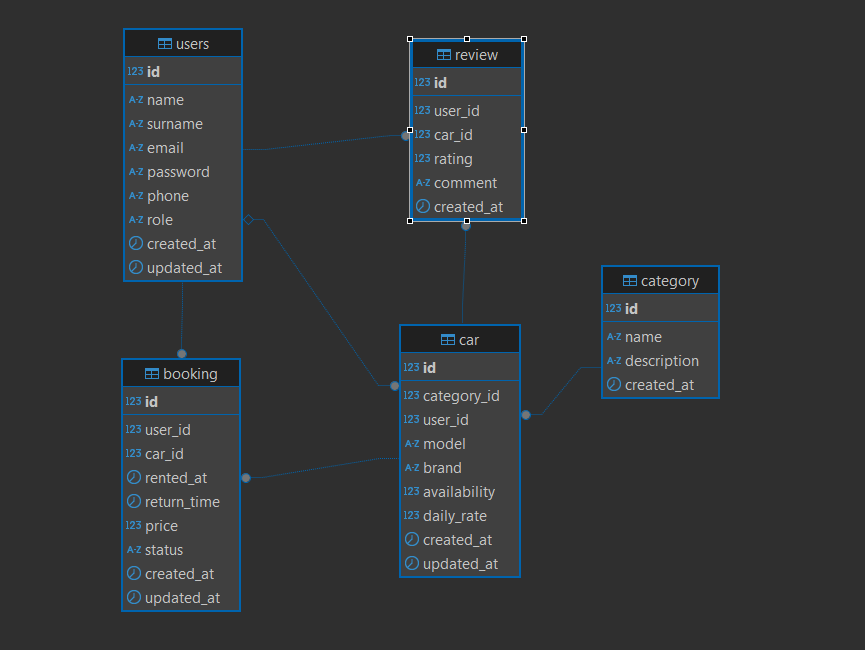

# Introduction to Web Programming Project

## RentACar - Car Rental Application

### Description

RentACar is a single-page application (SPA) for managing car rentals. It provides a user-friendly interface for customers to browse available cars, register/login, and manage their bookings. The frontend is built using HTML, Bootstrap, and JavaScript, with a focus on responsive design.

### Features - Milestone 1

- **User Login/Registration**: Login and register pages for user authentication.
- **Responsive Design**: Optimized for all devices (desktop, tablet, mobile).
- **Single-Page Application (SPA)**: Seamless navigation without page reloads.
- **ER Diagram**: Example showchase of backend look.

### ER Diagram

### Features - Milestone 2

- **Dao Base Files**: Implementation of necessary DAO files (from ER Diagram) for later use.
- **SQL Database Script**: SQL Script for database creation.

### Features - Milestone 3

- **Business Logic Implementation**: Implementation of services for managing each database entity, application logic and constraints.
- **Presentation Layer**: Implementation of presentation layer to render dynamic content using FlightPHP.
- **OpenAPI Documentation**: Documentation of available API endpoints using OpenAPI standard and generating visual API documentation page via Swagger

### Features - Milestone 4

TODO

### Features - Milestone 5

TODO
